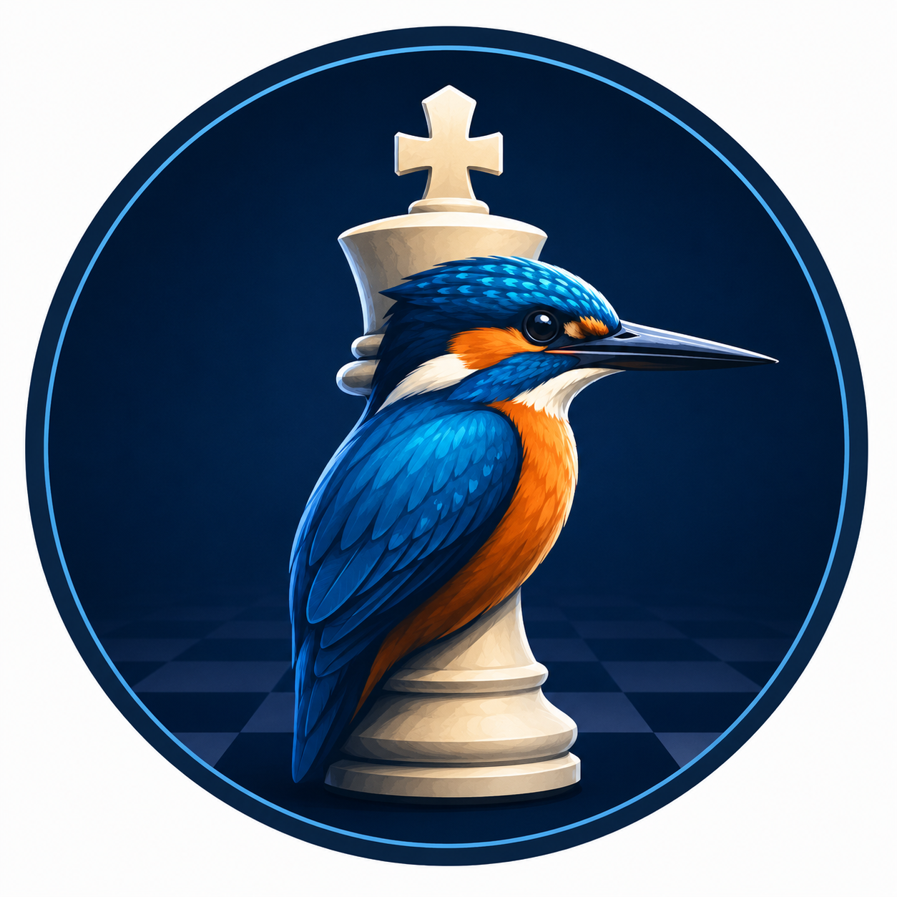

# Kingfisher

A fully offline desktop application that analyses a chess position from a move list and suggests the best next move. No internet connection, no API keys, no external chess engines required.

---

## Features

- **Paste move lists** — one move per line, or any standard format
- **Live board preview** — the board updates as you type, replaying every move
- **Best move with arrow** — the suggested move is shown as text and drawn as an arrow on the board
- **Play as White or Black** — board flips to keep your pieces at the bottom
- **Adjustable search depth** — trade speed for strength (depth 1–5)
- **Undo & Clear** — step back one move or reset the whole game
- **Fully offline** — everything runs locally, nothing is sent anywhere

---

## Requirements

- Python 3.8 or later
- [Pillow](https://pillow.readthedocs.io/) (for board rendering)

Install the dependency with:

```bash
pip install pillow
```

---

## Running the App

```bash
python agent.py
```

The GUI will open. No configuration needed.

---

## How to Use

### 1. Paste your moves

Copy your move list from chess.com, a PGN file, or anywhere else, and paste it into the left panel. The app accepts any of these formats:

```
e4
e5
Nf3
Nc6
```

```
1. e4 e5
2. Nf3 Nc6
3. Bb5
```

```
e4 e5 Nf3 Nc6 Bb5 a6
```

Move numbers (like `1.` or `2...`) are stripped automatically — just paste whatever you have.

### 2. Set your colour

Click **White** or **Black** in the toolbar to tell the app which side you are playing. This flips the board so your pieces are always at the bottom.

### 3. Analyse

Click **🔍 Analyse** (or press `Ctrl+Enter`). The engine will calculate the best move for whoever is to play and display it in the right panel with a red arrow on the board.

The **eval** score shown beneath the move is from White's perspective — a positive number means White is ahead, negative means Black is ahead.

### 4. Adjust depth

Use the **Depth** slider in the toolbar to control how deeply the engine searches:

| Depth | Speed | Strength |
|-------|-------|----------|
| 1–2 | Instant | Beginner |
| 3 | ~0.5s | Club level (default) |
| 4 | ~3–8s | Strong |
| 5 | ~30s+ | Very strong (slow on complex positions) |

---

## Supported Move Notation

The app parses full Standard Algebraic Notation (SAN):

| Notation | Example |
|----------|---------|
| Pawn moves | `e4`, `d5` |
| Piece moves | `Nf3`, `Bb5`, `Qd1` |
| Captures | `exd5`, `Nxc6` |
| Kingside castling | `O-O` |
| Queenside castling | `O-O-O` |
| Pawn promotion | `e8=Q` |
| Disambiguating moves | `Nbd2`, `R1e4` |
| Check / checkmate | `Nf3+`, `Qh5#` (symbols ignored) |

---

## How It Works

### Move parsing
Each move is parsed from SAN into an internal `from`/`to` representation by generating all legal moves for the current position and matching them against the notation. This means the board state is always exact — there is no guessing.

### Chess engine
The engine uses **Minimax with Alpha-Beta pruning**, the classical algorithm used in chess programs since the 1970s. It searches ahead by simulating all possible move sequences to a given depth and picks the one that leads to the best position.

Positions are scored using:
- **Piece values** — Queen 900, Rook 500, Bishop/Knight ~325, Pawn 100
- **Piece-square tables** — bonuses for good piece placement (e.g. knights are rewarded for being centralised, pawns for being advanced)

Alpha-Beta pruning cuts branches of the search tree that cannot affect the final result, making the engine roughly 10–100× faster than plain Minimax.

---

## Project Files

| File | Description |
|------|-------------|
| `agent.py` | Main application — run this |

Everything is contained in a single file with no external chess libraries.

---

## Limitations

- **No opening book** — the engine calculates from scratch rather than consulting a database of known openings, so early-game suggestions may be unconventional
- **No endgame tablebase** — very late-game positions with few pieces may not be solved perfectly at low depths
- **Promotions always to Queen** — underpromotion (e.g. promoting to a Knight) is not suggested, though it is supported in the move parser
- **Depth 5+ is slow** — complex middlegame positions at depth 5 can take 30 seconds or more

---

## License

MIT — do whatever you like with it.
